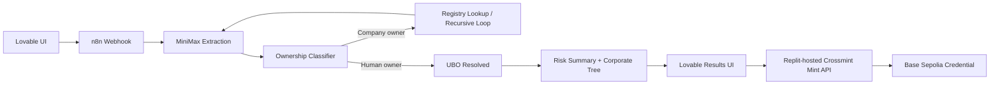
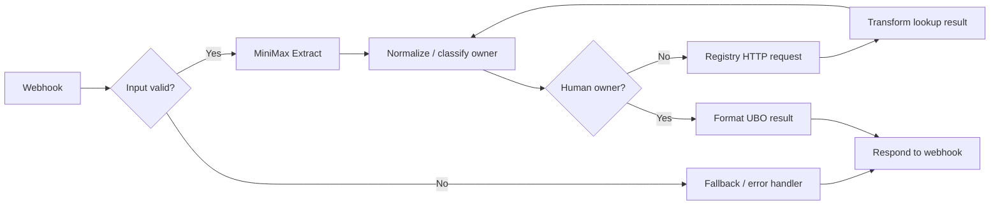

# ClearOwn

ClearOwn is an agentic KYB workflow that recursively traces layered corporate ownership to surface the Ultimate Beneficial Owner (UBO), flags jurisdiction risk, and issues a portable KYB credential after verification.

Built for hackathon judges to see one end-to-end story:

1. Upload or enter an entity in the Lovable app
2. Trigger an n8n investigation workflow
3. Use MiniMax to extract structured ownership/entity data from raw text or documents
4. Resolve the ownership chain through nested entities
5. Render the corporate tree and risk summary
6. Mint a reusable KYB Passport via Crossmint on Base Sepolia

## Why this matters

Business verification is still painfully manual. Compliance teams repeatedly investigate the same entities across banks, fintechs, exchanges, law firms, and funds. ClearOwn automates the hardest part of KYB: recursively traversing shell-company structures until a real human controller is found.

## Demo flow

The strongest judge-facing flow is:

1. Open the ClearOwn landing page in Lovable
2. Click `Launch Investigation`
3. Show the animated investigation screen
4. Show the final results screen with:
   - the identified UBO
   - the ownership chain
   - risk flags for high-risk jurisdictions
5. Click `Issue KYB Passport`
6. Show the credential card and Base Sepolia proof

## Stack

- Lovable: frontend, demo flow, results, credential display
- n8n: recursive orchestration / workflow logic
- MiniMax: AI extraction of entity and ownership information from documents
- Crossmint: minting the portable KYB Passport
- Replit: hackathon hosting layer for the mint service endpoint
- Base Sepolia: on-chain proof of credential issuance

## Architecture



## n8n workflow snapshot

The orchestration layer is built in n8n and follows the same recursive pattern shown below:



This mirrors the live demo workflow:

- webhook intake from Lovable
- document/entity extraction via MiniMax
- classification of current owner
- recursive registry lookup if the owner is another company
- final formatting of UBO, chain depth, and risk summary
- webhook response back to Lovable

Additional detail lives in:

- [Architecture](/Users/shazilfarukh/Desktop/KYB-Agent/docs/architecture.md)
- [Workflow](/Users/shazilfarukh/Desktop/KYB-Agent/docs/workflow.md)
- [Demo script](/Users/shazilfarukh/Desktop/KYB-Agent/docs/demo-script.md)
- [Judge Q&A](/Users/shazilfarukh/Desktop/KYB-Agent/docs/judge-qa.md)

## Repository structure

```text
crossmint-server/     Crossmint mint service used by the frontend
docs/                 Architecture, workflow, and demo documentation
n8n/                  Workflow notes and export placeholder
prompts/              Prompt assets used during UI and extraction work
samples/              Request/response contracts used across the system
```

## Integration contracts

Lovable -> n8n:

```json
{
  "entity_name": "HSBC Holdings",
  "jurisdiction": "United Kingdom",
  "doc_text": "Optional extracted document text"
}
```

n8n -> Lovable:

```json
{
  "ubo_found": true,
  "ubo_name": "John Smith",
  "depth": 3,
  "chain": [
    { "layer": 1, "entity": "HSBC Holdings", "jurisdiction": "United Kingdom", "risk": "low" },
    { "layer": 2, "entity": "Meridian Trust Co", "jurisdiction": "KY", "risk": "high" },
    { "layer": 3, "entity": "BVI Capital Ltd", "jurisdiction": "BVI", "risk": "high" }
  ],
  "risk_summary": "2 high-risk jurisdictions detected"
}
```

Lovable -> Crossmint mint service:

```json
{
  "ubo_name": "John Smith",
  "entity": "HSBC Holdings",
  "chain_depth": 3,
  "risk_summary": "2 high-risk jurisdictions detected",
  "verified_at": "2026-04-03T11:00:00Z",
  "recipient_email": "demo@clearown.com"
}
```

Crossmint service -> Lovable:

```json
{
  "success": true,
  "pending": false,
  "action_id": "13e84fb3-0610-4a7f-88b5-6c1f384bd9ef",
  "token_id": 8,
  "tx_hash": "0xa16db39723fc499e833f55a500104a6211a93a1ba6d3822c8bd609ee4e54c85c",
  "explorer_url": "https://sepolia.basescan.org/tx/0xa16db39723fc499e833f55a500104a6211a93a1ba6d3822c8bd609ee4e54c85c"
}
```

## Crossmint backend

The mint service used in the demo is included in [`crossmint-server`](/Users/shazilfarukh/Desktop/KYB-Agent/crossmint-server/server.js).

It exposes:

- `GET /api/`
- `POST /api/test-mint`
- `POST /api/mint`

## Running the Crossmint service locally

```bash
cd crossmint-server
npm install
cp .env.example .env
npm start
```

Required environment variables:

- `CROSSMINT_API_KEY`
- `CROSSMINT_COLLECTION_ID`
- `CROSSMINT_ENV=staging`
- `PORT=3000`

## What judges should look at

If the judges ask for the GitHub repo, point them to:

1. This README for the product/system overview
2. [Architecture](/Users/shazilfarukh/Desktop/KYB-Agent/docs/architecture.md) for how the workflow actually works
3. [`crossmint-server/server.js`](/Users/shazilfarukh/Desktop/KYB-Agent/crossmint-server/server.js) for the minting integration
4. [Workflow](/Users/shazilfarukh/Desktop/KYB-Agent/docs/workflow.md) for the end-to-end story
5. [Judge Q&A](/Users/shazilfarukh/Desktop/KYB-Agent/docs/judge-qa.md) for business framing and prepared answers

## Team workflow summary

- Frontend / product demo: Lovable
- Workflow logic: n8n
- Document extraction: MiniMax
- Credential issuance: Crossmint
- Hackathon backend hosting: Replit

ClearOwn is intentionally a hybrid build. The value is in the orchestration, risk workflow, and portable credential flow, not only in a monolithic codebase.
