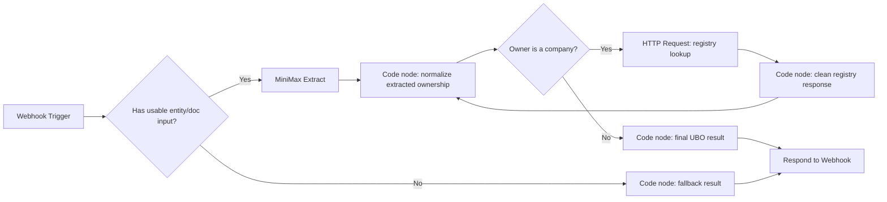

# Workflow

## Demo workflow

The intended demo sequence is:

1. Start on the ClearOwn landing page
2. Introduce the problem:
   recursive shell-company ownership is slow and manual
3. Click `Launch Investigation`
4. Show the investigation/loading sequence
5. Show the final results page
6. Highlight:
   - identified UBO
   - number of layers
   - risk jurisdictions
7. Click `Issue KYB Passport`
8. Show the credential card
9. Open BaseScan to prove mint completion

## n8n orchestration view

The n8n layer is the backend brain of the demo. Conceptually it looks like this:

This is the piece judges should think of as the recursive investigation engine.

## Operational workflow

### Lovable

- receives entity input
- triggers webhook
- shows investigation state
- renders final result
- calls mint API

### n8n

- receives Lovable payload
- triggers MiniMax extraction
- runs recursion loop
- scores jurisdictions
- returns result JSON

### MiniMax

- reads raw text or uploaded/extracted document content
- converts messy ownership language into structured JSON
- identifies likely owners/shareholders and ownership percentages
- provides n8n with a clean object to recurse on

### Crossmint service

- receives final verification payload
- creates credential metadata
- submits mint request
- polls completion
- returns action/transaction information

### Replit

- hosts the Crossmint mint API used during the hackathon demo
- exposes `/api/`, `/api/test-mint`, and `/api/mint`
- bridges Lovable and Crossmint without exposing secrets in the frontend

## Payload contracts

Canonical contract samples are in:

- [investigation request](/Users/shazilfarukh/Desktop/KYB-Agent/samples/investigation-request.json)
- [investigation response](/Users/shazilfarukh/Desktop/KYB-Agent/samples/investigation-response.json)
- [mint request](/Users/shazilfarukh/Desktop/KYB-Agent/samples/mint-request.json)
- [mint response](/Users/shazilfarukh/Desktop/KYB-Agent/samples/mint-response.json)
